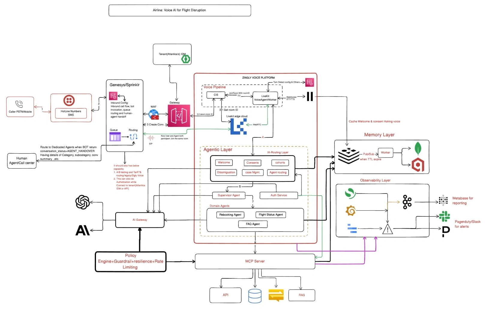

# Voice AI for Flight Disruption
## What is this?

Atlantica Airways (fictional) gets a flood of calls when weather cancels flights. This design puts a **Zingly voice agent** at the front of its phone line. The agent:

1. **identifies** the caller and their disrupted booking,
2. **explains** their options,
3. **rebooks** them and confirms by SMS, **or hands them to a Genesys agent** who already has the full context. When all agents are busy, it books a callback.

Twilio stays the carrier, Genesys stays the contact centre, and the reservation system stays the system of record. The design protects that rate-limited reservation system during a 20x spike and degrades gracefully when any part fails.



## Deliverables

| # | Deliverable | Where |
|---|---|---|
| 1 | **Solution design** (5 pages) | [Web page](https://dharam1291.github.io/assignment_zingly/) · [Markdown](docs/SOLUTION_DESIGN.md) |
| 2 | **Prototype** | `prototype/`, coming next |

## View it

**Online:** https://dharam1291.github.io/assignment_zingly/ (needs GitHub Pages on: Settings → Pages → Deploy from a branch → `main` / `/docs`).

**Locally:** download the repo and open `docs/index.html` in a browser. It is one self-contained file. GitHub itself only shows this file as source code.

## Rebuild

Python 3.11+, standard library only.

```bash
  python docs/diagrams/build_diagrams.py && python docs/build_site.py
```