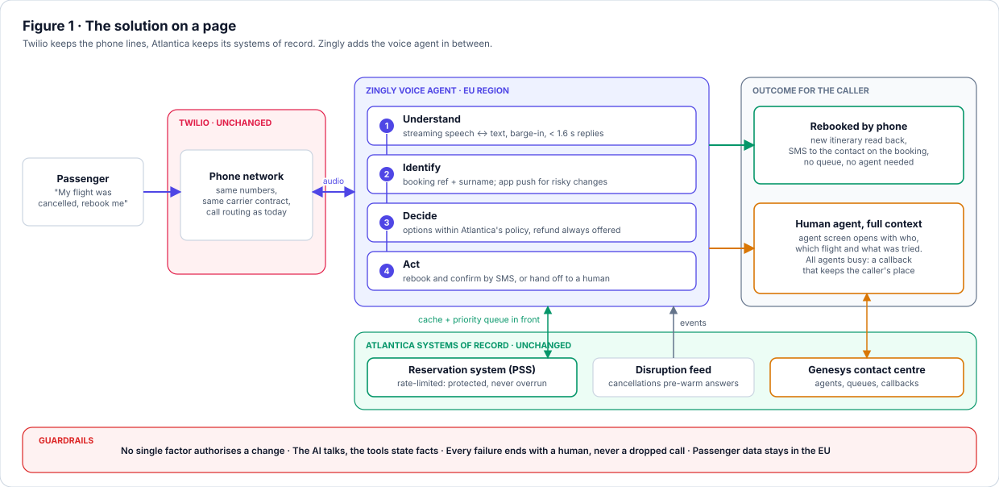

# Atlantica Airways · Voice AI for Flight Disruption

**Zingly Senior Solutions Architect exercise, Scenario 2.** A Zingly voice agent replaces the top of Atlantica's phone IVR for its #1 call driver, flight disruption.

The agent identifies the caller, explains their options, and either rebooks them or hands them to a Genesys agent who already has the full context. Twilio, the reservation system and Genesys stay exactly where they are.



## Start here

| If you are… | Read | Time |
|---|---|---|
| **Anyone, first look** | The web version: [`docs/index.html`](docs/index.html) (live at [dharam1291.github.io/assignment_zingly](https://dharam1291.github.io/assignment_zingly/) once Pages is on) | 5 min for the summary |
| **Business sponsor** | §0 Executive summary → §3 The call → §10 Degraded modes → §12 Delivery | 10 min |
| **Enterprise IT architect** | §2 Overview → §5 Protecting the PSS → §6 Genesys handoff → §7 Integration | 25 min |
| **Security lead** | §4 Caller identification → §8 Security & compliance → §9 LLM safety | 15 min |
| **Reviewer wanting the formal document** | [`docs/SOLUTION_DESIGN.md`](docs/SOLUTION_DESIGN.md) | 30 min |

## The design in five decisions

1. **Zingly sits behind Twilio, not instead of it.** Twilio keeps the numbers and the PSTN. Zingly receives the audio over bidirectional Media Streams and runs streaming STT → LLM → TTS, with a **≤ 1.6 s p95** response budget and barge-in handled in its own media gateway.
2. **The reservation system is protected by design.** Storm callers are correlated, so Zingly:
   - pre-computes options when the cancellation event arrives,
   - caches per flight,
   - coalesces identical requests,
   - admits the rest through priority lanes.

   Rebookings always get through and the rate limit is never exceeded. The capacity sketch drops ~42 TPS to ~13 TPS.
3. **Identity is a level, not a yes/no.** A matching caller ID gives a hint only. Booking reference + surname allows an in-policy rebook. App push or OTP is needed for anything riskier. Every change is announced to the contact on the booking.
4. **Only an opaque ID crosses SIP.** Genesys pulls the handoff context server-side through a Data Action under OAuth client credentials. The agent's screen opens already showing who is calling, their flight, and **what was already tried**. When every agent is busy, the caller gets a callback that keeps their place.
5. **Every failure ends with a human.** LLM, STT, TTS, PSS, Genesys and Zingly's own outages each have a designed caller experience. If Zingly dies mid-call, Twilio's fallback (hosted outside Zingly) routes the caller to the queue.

## Deliverables

| # | Deliverable | Where | Status |
|---|---|---|---|
| 1 | Solution design document | [`docs/SOLUTION_DESIGN.md`](docs/SOLUTION_DESIGN.md) · web: [`docs/index.html`](docs/index.html) | Done (v2.0) |
| 2 | Prototype: simulated disruption call, rate-limited PSS mock, cache + admission control, Genesys handoff payload, spike script | `prototype/` | In progress |

## Repository layout

```
docs/
├── SOLUTION_DESIGN.md        the design document (source of truth for content)
├── index.html                web version, built from site/template.html + the SVGs
├── site/template.html        hand-authored page layout; figures are {{FIG:name}} placeholders
├── build_site.py             inlines the SVGs into the template → index.html
└── diagrams/
    ├── build_diagrams.py     one function per figure, explicit coordinates
    ├── svgkit.py             shared drawing primitives (boxes, zones, arrows, sequences)
    └── 01…08-*.svg           generated figures
```

## Rebuilding the docs

The diagrams are code, not screenshots, so a live whiteboard change is a small diff. Everything uses only the Python standard library (3.11+).

```bash
python docs/diagrams/build_diagrams.py
```

```bash
python docs/build_site.py
```

To publish the web version, enable **Settings → Pages → Deploy from a branch → `main` / `/docs`**. Locally, open `docs/index.html` directly: it is a single self-contained file.

## Use of AI assistants

AI assistants helped draft the structure and first-pass text, generate the diagram code, and check vendor behaviour against public documentation. I reviewed and own every architectural decision and compliance statement. Anything I could not verify is listed as an open question rather than asserted (design document §15).
