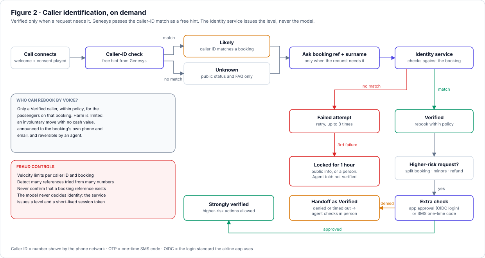
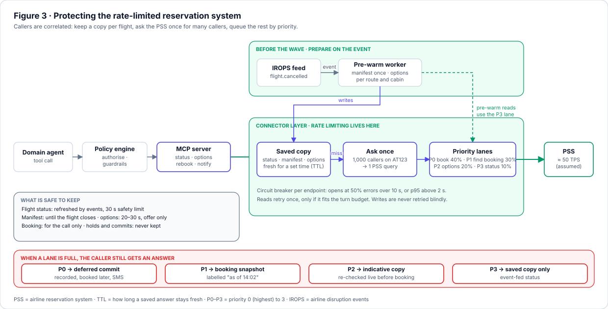
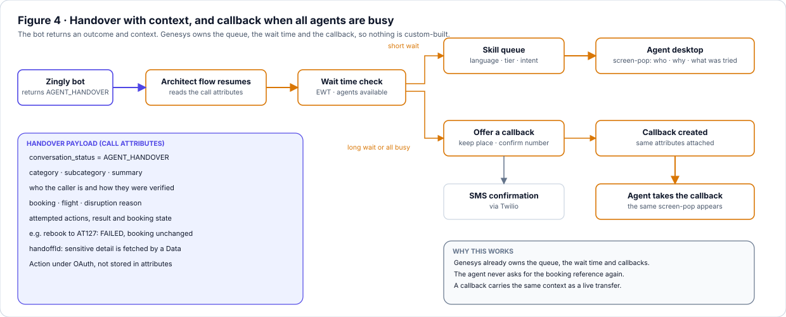

# Atlantica Airways: Voice AI for Flight Disruption

**Solution design** · Zingly Voice Platform · Dharmendra Singh · v1.0 · October 2026

## 1. Summary

**Problem.** When weather cancels flights, calls jump 20x within minutes. Callers queue and repeat their booking reference, and every call loads a reservation system with strict rate limits.

**Solution.** A Zingly voice agent identifies the caller, explains their options, then either **rebooks them** (confirmed by SMS) or **hands them to a Genesys agent** who already has the full context. If every agent is busy, it books a callback. Twilio, Genesys and the reservation system (PSS) stay as they are, and if the bot is down the call goes to the human queue.

## 2. Architecture

*Figure 1: High-level architecture. Twilio → Genesys → bot or human.*

**How a call flows** (step numbers refer to Figure 1):

1. The caller dials the hotline. **Twilio** owns the number and passes the call to **Genesys** (steps 1–2).
2. A Genesys inbound flow decides **bot or human** using the A/B traffic percentage between the legacy IVR and Zingly, and calls Zingly's gateway to create a conversation (step 3).
3. Zingly creates a **LiveKit room** and returns the room ID. Genesys joins by SIP and the **voice agent worker** joins too, so both are participants in one room.
4. The worker handles speech and streams to the STT/TTS vendor. Welcome and consent audio is **pre-rendered and cached**, so it plays with no TTS call.
5. Transcripts go to the **AI-routing layer** (welcome, consent, disambiguation, case management, routing), which calls the separate **Auth service** when a request needs verification (step 5).
6. A **supervisor agent** picks a **domain agent**: Rebooking, Flight Status or FAQ (step 7). Domain agents reach the LLMs only through the **AI gateway**, using EU-region OpenAI and Anthropic deployments.
7. Every tool call passes the **Policy engine** (guardrails, resilience, rate limiting), then the **MCP server** to Atlantica's APIs, databases and knowledge base (step 8).
8. When the bot finishes or escalates, it returns `conversation_status=AGENT_HANDOVER` with category, subcategory and summary, and Genesys routes to a dedicated human agent.

**Why this shape.** Genesys in front gives A/B rollout, queues, callbacks and the human fallback for free. LiveKit rooms make the bot a real participant, so a human can join the same room and turn-taking, barge-in and vendor swaps come from the framework. Layered agents mean a new use case, such as baggage, is just a new domain agent. The AI gateway handles model routing, failover and PII redaction, and the MCP server is one standard door to Atlantica systems.

## 3. Voice pipeline

**Where Zingly sits relative to Twilio:** behind Genesys, which is behind Twilio. Twilio is the carrier only. Zingly receives the call from Genesys over SIP, into a LiveKit room, and every stage streams.

**Barge-in is handled in the voice agent worker.** At least 200 ms of caller speech plus a speech-to-text partial stops the audio, trims the bot's turn to the words actually heard, and tells the router. The AI disclosure and itinerary read-back cannot be interrupted.

**LLM hops are controlled by turn path**, so a caller can say anything:

| Turn path | Example | What decides | LLM calls before audio |
|---|---|---|---|
| Greeting, yes/no, keypad | "Hi" · "yes" | A fast path of exact-match rules on the transcript. No model. | **0** |
| Normal turn, same topic | "Move me to the 14:05" | The domain agent already running understands, confirms the topic, picks the tool and replies in one streamed call | **1** |
| First turn or topic change | "Where is my bag?" | One small classifier (domain, intent, confidence, "clarify?"), then the new domain agent | **1 small + 1** |
| Ambiguous or multi-step | "Change two flights and a hotel" | The supervisor plans with an LLM while a filler phrase plays | **2–3** |

**How "Hi" is handled without an LLM.** A fast path sits in front of the model. It normalises the transcript (lower-case, punctuation and filler removed) and compares it to short lists of greetings, acknowledgements, yes/no words and keypad digits. It fires only when the **whole utterance** matches, so "Hi, my flight was cancelled" goes on to the agent. Yes and no are read against the **pending question** the session already holds (consent, or "shall I book the 14:05?"), so they are never guessed. The welcome has already played at call start, so the reply to "Hi" is a cached phrase such as "How can I help with your flight today?". Anything the rules do not match goes to the LLM, so a miss costs one call, not a wrong answer.

**How we know the caller stayed on topic.** We do not assume it; we check on every turn at no extra cost. The domain agent runs on every turn anyway, and its output begins with a small decision field: `stay`, `switch:<domain>` or `clarify`. Speech starts only after that field, so nothing off-topic is spoken. If the caller changes topic ("Where is my bag?" during a rebooking), the field says `switch:baggage`, the small classifier confirms the new domain, and session state (identity level, booking, pending choice) carries over so the first task can resume. A side question such as an FAQ goes to the FAQ agent and then returns to the open task. On `clarify` the bot asks one short question. So staying on topic costs no extra call, and a topic change costs one small one.

## 4. Caller identification and fraud

**Verify on demand.** Nothing is asked until a request needs it. Genesys passes the caller-ID match as a free hint, and the **Auth service** checks the rest during the call, so flight status and FAQ never need a check. Authenticating every call upfront in Genesys was rejected: it adds friction for everyone, booking references are awkward on a keypad, and the bot can already do it in conversation.

*Figure 2: Identity is a level. The Auth service issues it, never the model.*

| Level | How it is reached                                                                                          | What it unlocks |
|---|------------------------------------------------------------------------------------------------------------|---|
| **Unknown** | Nothing or decline to authenticate                                                                         | Public flight status and FAQ |
| **Likely** | The caller's number matches a booking on a cancelled flight                                                | A masked summary. **No changes.** |
| **Verified** | Spoken booking reference plus surname, read back for confirmation                                          | Rebooking within the involuntary re-accommodation policy |
| **Strongly verified** | Verified, plus approval in the Atlantica app (OIDC login, matching two-digit code) or an SMS one-time code | Higher-risk actions: split bookings, minors, refunds |

**Failure path.** After three failed attempts self-service locks for one hour. The caller still gets public information or a person, and the agent is told the caller was not verified. The bot never confirms that a booking reference exists.

**Who can rebook by voice?** Only a Verified caller, within policy, for the passengers on that booking

## 5. Protecting the reservation system

Storm callers are **correlated**: a thousand people on AT123 want the same alternatives. So the design keeps a copy per flight.

*Figure 3: Prepare early, keep a copy, ask once, queue by priority.*

1. **Prepare early.** A `flight.cancelled` event triggers a worker that pulls the passenger list once and computes alternatives before most callers dial.
2. **Keep a copy.** Zingly's own encrypted copy of status, passenger list and options. It is **not a PSS replica**.
3. **Ask once.** Concurrent requests for the same thing become one PSS query, so 1,000 callers cost one.
4. **Priority lanes.** Requests that miss the copy queue by importance, so a status lookup never blocks a rebooking.

The four lanes are P0 booking or holding a seat (40% of capacity), P1 finding the caller's booking (30%), P2 refreshing options (20%) and P3 flight status (10%). When P0 is full the caller gets a **deferred commit**: the choice is recorded, booked shortly after and confirmed by SMS (needs business sign-off). Other full lanes fall back to a labelled snapshot or the saved copy.

**Safe to keep:** flight status (30 s), passenger list (until the flight closes), options (20–30 s, offer only), a booking (for the call only). **Never kept:** holds and commits. A booking always re-checks the PSS live.

**At 20x.** Genesys makes a **capacity check** on Zingly before routing each call, which reads active sessions, vendor headroom and reservation-system health. A predictive autoscaler adds voice workers when a disruption event arrives, before the calls do. Speech and LLM vendors have reserved capacity and a secondary. Above capacity the call overflows to the human queue with a callback offer, so no caller gets a busy tone.

## 6. Handover, screen-pop and callback

*Figure 4: Genesys owns the queue, the wait time and the callback.*

The bot returns `AGENT_HANDOVER` with **category, subcategory and summary**, **who the caller is and how they were verified**, the booking and disruption, and **every attempted action with its result** (for example "rebook to AT127 failed: reservation timeout, booking unchanged"). The Genesys flow reads these attributes, and sensitive detail is fetched by a Data Action under OAuth. On a **short wait** the call goes to a skill queue and the agent's screen-pop shows who, why and what was tried. On a **long wait or when all agents are busy** the flow offers a **callback** that keeps the caller's place, confirmed by SMS, with the same attributes and the same screen-pop.

## 7. Degraded modes

| Failure | What the system does | What the caller hears |
|---|---|---|
| **LLM latency spike** (p95 first token > 800 ms) | AI gateway hedges to a secondary model at 600 ms, then **deterministic mode**: templates, LLM only extracts answers | Same task, more scripted. Filler audio, no dead air. |
| **LLM outage** | Deterministic mode with grammar-based slots | "Say or key in option 1 or 2." |
| **Speech-to-text outage** | Secondary STT within 2 s, then keypad (DTMF) mode | "Please use your keypad." |
| **Text-to-speech outage** | Secondary TTS, then cached phrases | A different voice, same flow |
| **Reservation system brownout** | Lanes tighten, answers from the saved copy labelled "as of", commits become deferred commits | "I've recorded your choice of the 14:05. You'll get a text within 30 minutes." |
| **Reservation system down** | Information-only mode, changes paused, handover with exact state | Accurate status and a callback offer. No false promises. |
| **Zingly unavailable or full** | Genesys flow error path sends the call to the human queue or a callback | A brief pause, then a person. **Never a dropped call.** |

## 8. Integration and security

| Interface | Auth | Semantics |
|---|---|---|
| Genesys → Zingly gateway (create conversation, capacity check) | OAuth 2.0 client credentials, 5-minute audience-restricted tokens, WAF | Idempotent on call ID |
| Genesys ↔ LiveKit room | SIP over TLS with SRTP, IP allow-list | Caller and agent join one room |
| Zingly → Atlantica (via MCP) | mTLS, per-tenant vault credentials | Budgeted reads, idempotent writes |
| Atlantica → Zingly (events); Zingly → Genesys (callback, wait time) | Signed webhook or stream; OAuth client credentials | At-least-once, ordered per flight; honour `Retry-After` on 429 |
| Extra check (Strongly verified) | Atlantica app login (**OIDC**) approves a push. Atlantica returns a signed token, expiry ≤ 120 s. | Verified against Atlantica's keys |

**Retries and idempotency:** the rebooking key is `hash(tenant, booking, from-flight, to-flight)` and excludes the call ID, so a dropped call that dials back cannot rebook twice. A timed-out write is never blindly retried: read the booking first, then retry under the same key. A failed commit after a hold releases the hold.

**Data protection**
- **Residency:** the whole platform, including the OpenAI and Anthropic deployments, runs in the EU. As Zingly is a US vendor, a DPA with Standard Contractual Clauses and a transfer-impact assessment are still needed.
- **PII** is tokenised before the model and restored at speech time. No payment or health data reaches it. No retention, no training.
- **Storage:** encrypted in transit and at rest with per-tenant keys. Redacted transcripts kept 30 days, handoff context 24 hours, no audio stored.
- **Model safety:** flight times and entitlements come from tools and approved wording, never the model. Tools are allow-listed per identity level and every call is logged.

**Compliance.** **GDPR/UK GDPR** is the primary frame (contract performance, data minimisation, DPIA before go-live).